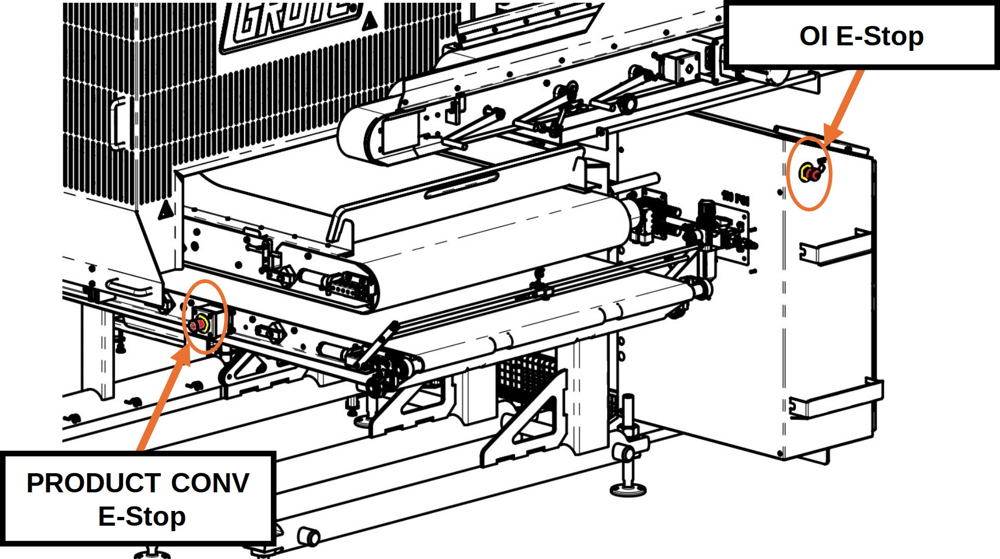
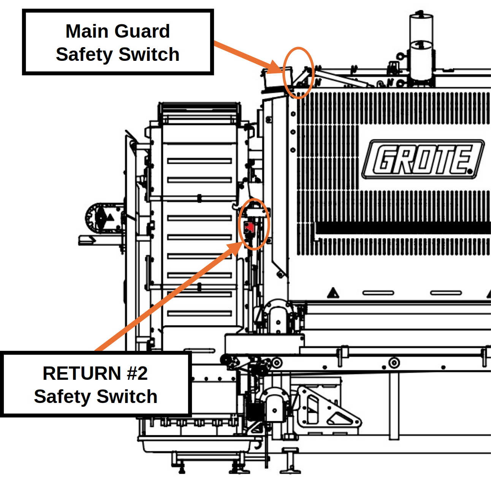

# 1  Safety

## 1.1 Emergency Stop Devices

Two emergency stop devices are installed on the Applicator: one on the operator interface enclosure, and one on the PRODUCT CONVEYOR frame opposite the operator interface. A third device is on the OI swing arm when that option is installed.

When pressed, the device removes all motion from the Applicator. To reset, pull the actuator until it releases.

<figure markdown>
  { width="600" }
  <figcaption>Figure 1.1  Emergency Stops Location</figcaption>
</figure>

## 1.2 Non-Contact Safety Switches

Two safety switches monitor guard position on the Applicator: one on the RETURN #2 guard and one on the MAIN GUARD.

<figure markdown>
  { width="500" }
  <figcaption>Figure 1.2  Non-Contact Safety Switches Location</figcaption>
</figure>

## 1.3 Safe State Definition

Activating an emergency stop device or opening a safety guard places the Applicator in a safe state. The following occur automatically:

- All motion commands are removed. Motors coast to stop.
- PID control loops are disabled.
- Pneumatic air supply to the PRODUCT CONVEYOR and PORTION CONVEYOR tension cylinders is removed. Cylinders retract, and belt tension is released.
- The MACHINE ENABLE circuit must be reset before operation can resume.

!!! warning
    **WARNING Belt Tension Loss.**
    When PORTION CONVEYOR tension cylinders retract, the belt loses tension and may contact targets remaining on the PRODUCT CONVEYOR.

!!! note
    Emergency stop devices are for emergency conditions only. For normal shutdown, use the STOP control on the HOME screen.