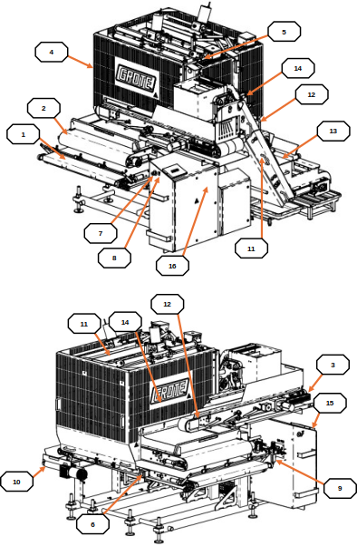
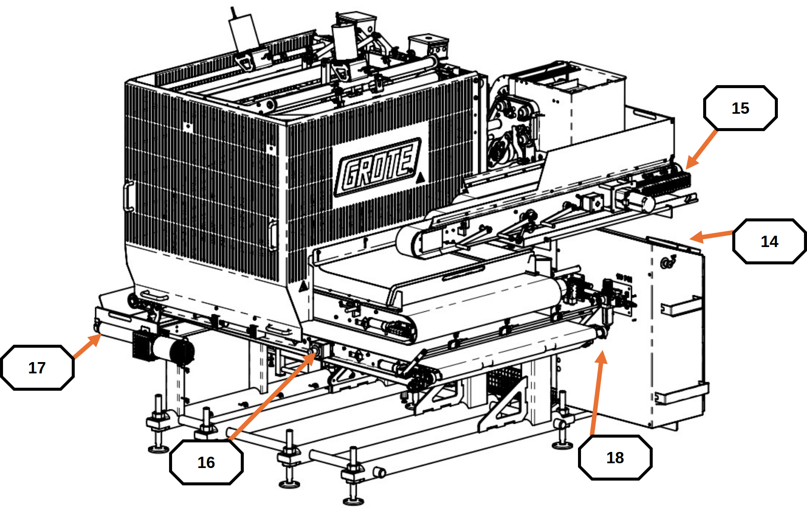
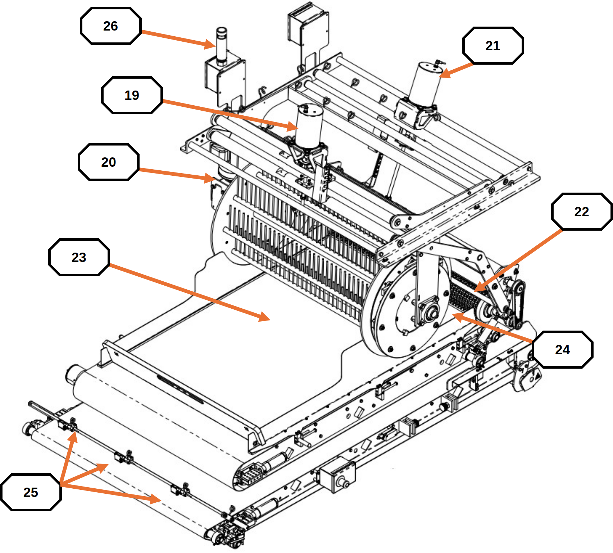
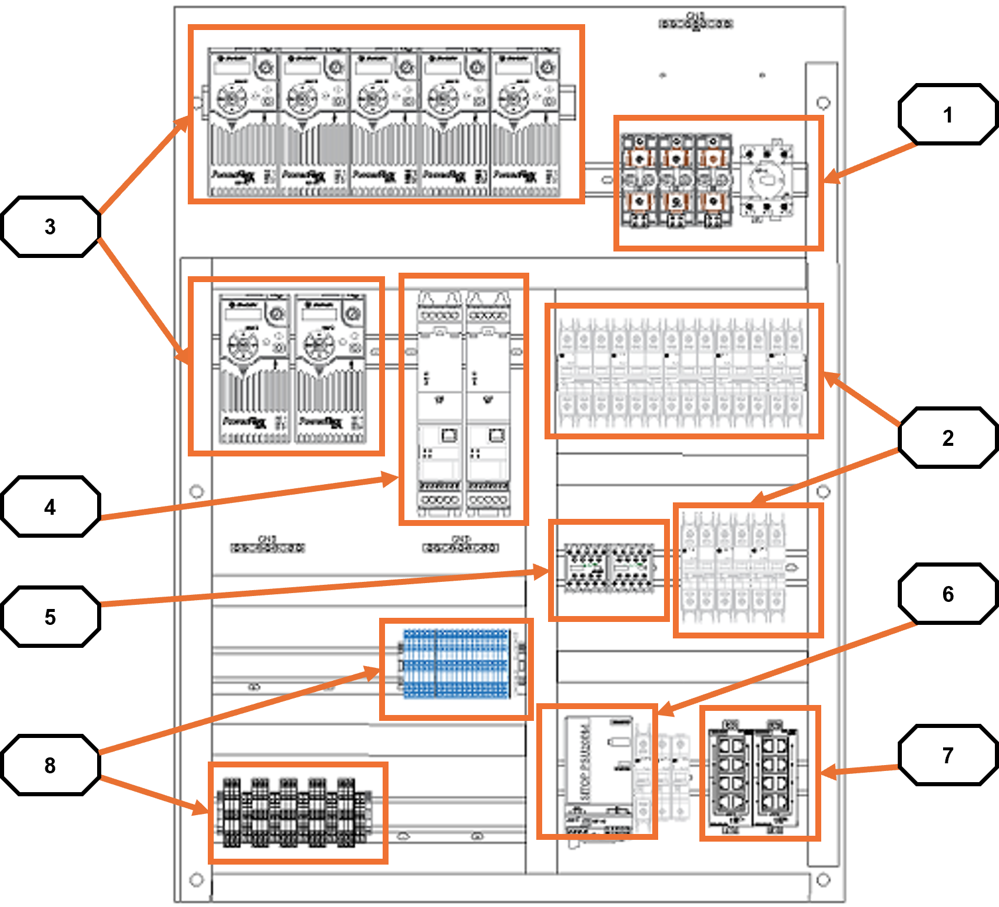
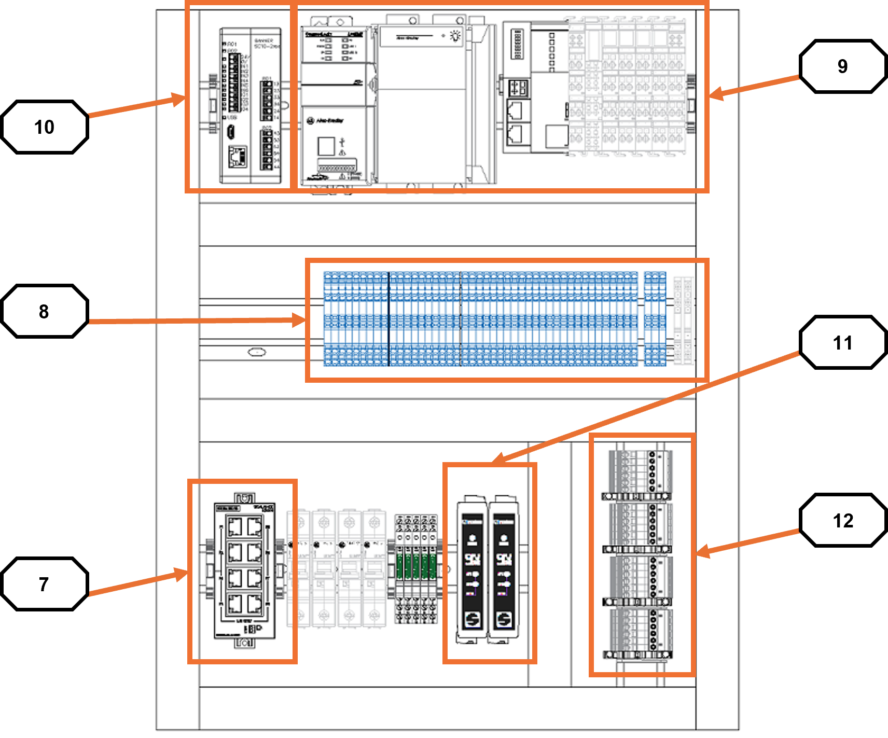

# 2  Equipment Overview

## 2.1 Component Identification

The diagrams below identify all major components.

<figure markdown>
  { width="600" }
  <figcaption>Figure 2.1a  Primary components, callouts [1]–[13]</figcaption>
</figure>

| # | Component |
|---|---|
| 1 | PRODUCT CONVEYOR |
| 2 | PORTION CONVEYOR |
| 3 | MAIN GUARD |
| 4 | MAIN GUARD SWITCH |
| 5 | MACHINE ENABLE PUSH BUTTON |
| 6 | OI ENCLOSURE E-STOP |
| 7 | RETURN #2 CONVEYOR |
| 8 | HOPPER HEIGHT SENSOR |
| 9 | HOPPER |
| 10 | RETURN #2 GUARD SWITCH |
| 11 | ELECTRICAL DISCONNECT |
| 12 | AC ENCLOSURE |
| 13 | DC ENCLOSURE |

<figure markdown>
  { width="600" }
  <figcaption>Figure 2.1b  Primary components, callouts [14]–[18]</figcaption>
</figure>

| # | Component |
|---|---|
| 14 | OPERATOR INTERFACE (OI) |
| 15 | RETURN #3 CONVEYOR |
| 16 | PRODUCT CONVEYOR E-STOP |
| 17 | RETURN #1 CONVEYOR |
| 18 | AIR SUPPLY |

<figure markdown>
  { width="600" }
  <figcaption>Figure 2.1c  Upper assembly components, callouts [19]–[26]</figcaption>
</figure>

| # | Component |
|---|---|
| 19 | RAKE HEIGHT MOTOR |
| 20 | RAKE MOTOR |
| 21 | FLICKER HEIGHT MOTOR |
| 22 | FLICKER MOTOR |
| 23 | RAKE LOAD CELLS |
| 24 | PORTION LOAD CELLS |
| 25 | TARGET PHOTOEYES |
| 26 | STACKLIGHT |

!!! note
    Component descriptions are in [Appendix B: Glossary](../sections/appendix-b.md).
    Control panel layouts are in [Section 2.2: Control Panel Layout](#22-control-panel-layout).

---

## 2.2 Control Panel Layout

The Applicator has two control enclosures. The AC enclosure contains 
high-voltage components. The DC enclosure contains low-voltage (24VDC)
components including the load cell signal amplifiers.

<figure markdown>
  { width="600" }
  <figcaption>Figure 2.2a  AC enclosure layout, callouts [1]–[8]</figcaption>
</figure>

| # | Component |
|---|---|
| 1 | ELECTRICAL DISCONNECT / FUSES |
| 2 | CIRCUIT BREAKERS |
| 3 | VARIABLE FREQUENCY DRIVES (VFD) |
| 4 | VARIABLE SPEED STARTERS (VSS) |
| 5 | SAFETY CONTACTORS |
| 6 | POWER SUPPLY |
| 7 | NETWORK SWITCHES |
| 8 | WIRE TERMINALS |

<figure markdown>
  { width="600" }
  <figcaption>Figure 2.2b  DC enclosure layout, callouts [9]–[12]</figcaption>
</figure>

| # | Component |
|---|---|
| 9 | PLC AND I/O |
| 10 | SAFETY PLC |
| 11 | ANALOG SIGNAL CONDITIONER |
| 12 | LOAD CELL WIRE TERMINALS |

!!! note
    For load cell amplifier calibration procedures, see
    [Section 8: Load Cell Calibration](08-load-cell-calibration.md).