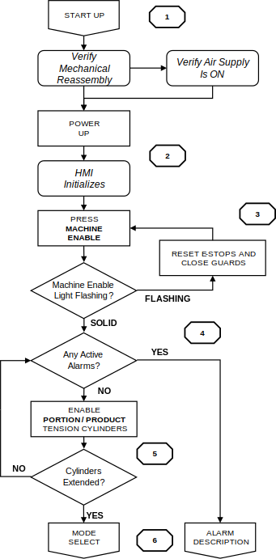

# 3  Startup

## 3.1 Startup Sequence

<figure markdown>
  { width="350" }
  <figcaption>Figure 3.1  Startup sequence flowchart</figcaption>
</figure>

1. Confirm the Applicator is fully reassembled. Belts, guards, and scrapers are all in place.

2. Verify the compressed air supply is ON.

3. Turn the ELECTRICAL DISCONNECT to the ON position. Wait for the PLC and OI to finish initializing. The HOME screen appears when ready. If active alarms are present, the OI displays the ALARMS screen first. Navigate to ALARMS, correct all conditions, then press FAULT RESET.

    !!! note
        If the MACHINE ENABLE indicator flashes: reset all emergency stop devices, close all guards, then press MACHINE ENABLE again. If it continues to flash, navigate to MANUAL → SAFETY PLC to identify which device remains open. If alarm conditions remain, navigate to the ALARMS screen and press FAULT RESET after each condition is corrected.

4. Press the MACHINE ENABLE push button. Verify the MACHINE ENABLE indicator is illuminated solid.

5. Enable the PORTION CONVEYOR and PRODUCT CONVEYOR tension cylinders from the HOME screen. Confirm that both are fully extended before proceeding.

6. When all criteria are satisfied, proceed to [Section 4: Operating Modes](04-operating-modes.md).
