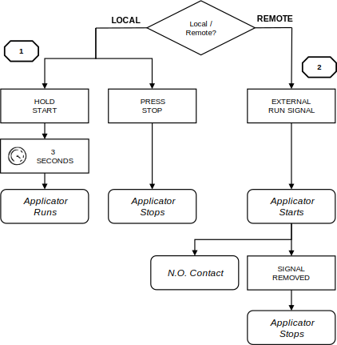
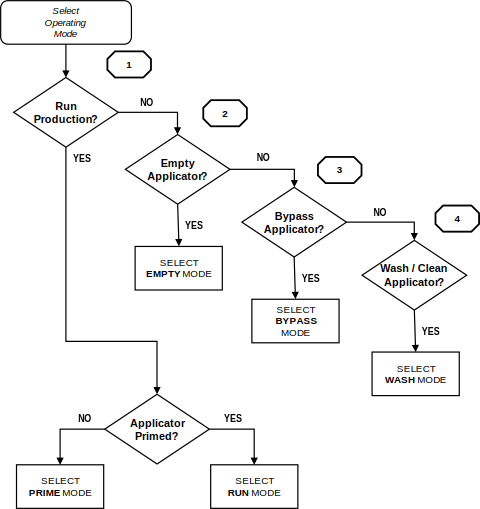
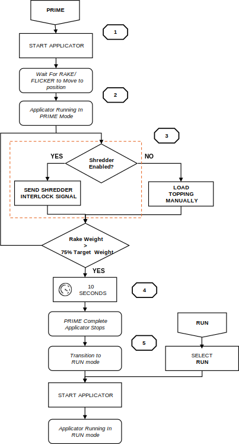
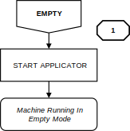
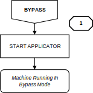
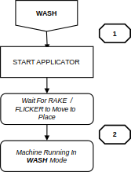
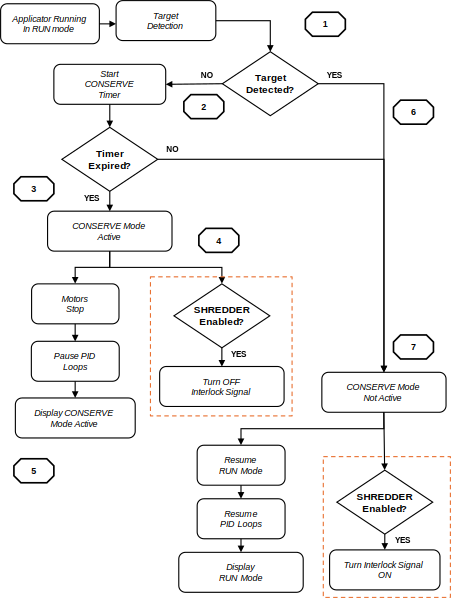

# 4  Operating Modes

Sections 4.3 through 4.6 describe the four operator-selected modes. PRIME
and CONSERVE are automatic states. The Applicator enters PRIME and CONSERVE
modes based on operating conditions.

## 4.1 Applicator Control: LOCAL and REMOTE

<figure markdown>
  
  <figcaption>Figure 4.1  LOCAL and REMOTE control flowchart</figcaption>
</figure>

- **LOCAL control:** Start and stop the Applicator from the HOME screen
  using PRESS TO START and STOP. The Applicator runs independently of any
  upstream or downstream equipment.
- **REMOTE control:** An external line signal starts and stops the
  Applicator. A dry-contact output (Upstream Interlock) sends the
  Applicator's run status to upstream equipment.

---

## 4.2 Mode Selection

<figure markdown>
  
  <figcaption>Figure 4.2  Operating mode selection flowchart</figcaption>
</figure>

- **Run Production.** Select RUN mode for normal topping application. The
  Applicator verifies priming criteria before starting. If not met, the OI
  prompts the operator to complete PRIME mode first.
- **Empty Applicator.** Select EMPTY mode to clear topping from the
  Applicator.
- **Bypass Applicator (Pass-Thru).** Select BYPASS mode to run the PRODUCT
  CONVEYOR without applying topping. This mode allows operation with the
  MAIN GUARD and/or RETURN #2 guard open.
- **Wash / Clean Applicator.** Select WASH mode for cleaning. The RAKE and
  FLICKER move to preset heights. All motors run at preset speeds.

---

## 4.3 PRIME / RUN Mode

<figure markdown>
  
  <figcaption>Figure 4.3  PRIME and RUN mode flowchart</figcaption>
</figure>

### PRIME Mode

1. Select PRIME mode. Press and hold PRESS TO START for three seconds.
2. The RAKE and FLICKER move to recipe positions. Allow travel to complete
   before loading topping.
3. If the SHREDDER option is enabled, topping feed starts automatically.
   Otherwise, load topping manually at the HOPPER.
4. Priming continues until RAKE weight exceeds 75% of TARGET LEVEL for
   10 continuous seconds.
5. When complete, the Applicator transitions automatically to RUN mode.

!!! note
    PRIME mode is available only in LOCAL control. Selecting RUN mode before
    priming is complete prompts the OI to require PRIME mode to finish first.

---

## 4.4 EMPTY Mode

<figure markdown>
  
  <figcaption>Figure 4.4  EMPTY mode flowchart</figcaption>
</figure>

1. Select EMPTY mode. Press and hold PRESS TO START for three seconds.

!!! note
    Depending on MOTOR SETUP configuration, RETURN #1 and/or RETURN #3 may
    run in reverse. EMPTY mode is available in LOCAL control only.

---

## 4.5 BYPASS Mode

<figure markdown>
  
  <figcaption>Figure 4.5  BYPASS mode flowchart</figcaption>
</figure>

1. Select BYPASS mode. Start the Applicator. The PRODUCT CONVEYOR operates
   without topping application.

!!! note
    RETURN #1 has a manual run function in BYPASS mode to clear accumulated
    topping. When enabled, the INFEED and OUTFEED CONVEYORS run with the
    PRODUCT CONVEYOR in BYPASS mode. BYPASS mode is available in LOCAL and
    REMOTE control.

---

## 4.6 WASH Mode

<figure markdown>
  
  <figcaption>Figure 4.6  WASH mode flowchart</figcaption>
</figure>

1. Select WASH mode. Press and hold PRESS TO START for three seconds.
2. The RAKE and FLICKER travel to the upper position (~2.0–2.5 in). Confirm
   travel is complete before opening guards or removing belts.

!!! note
    In WASH mode, all motors operate at preset speeds and preset heights.
    WASH mode is available only in LOCAL control.

---

## 4.7 CONSERVE Mode

<figure markdown>
  
  <figcaption>Figure 4.7  CONSERVE mode flowchart</figcaption>
</figure>

1. During RUN mode, the Applicator monitors the TARGET PHOTOEYES.
2. If no target is detected, the Conserve timer starts. A target arriving
   before the timer expires resets the timer, and operation continues
   normally.
3. If the timer expires, the Applicator enters CONSERVE mode.
4. All motors except the PRODUCT CONVEYOR, INFEED CONVEYOR, and OUTFEED
   CONVEYOR (if enabled) stop. PID loops pause. The SHREDDER interlock
   (if enabled) turns OFF.
5. The OI displays MACHINE RUNNING CONSERVE MODE ACTIVE on the information
   banner.
6. When a target is detected, CONSERVE mode clears automatically.
7. Motors, including the INFEED and OUTFEED CONVEYORS, and PID loops return
   to normal RUN mode operation. The SHREDDER interlock (if enabled) turns
   back ON.

!!! warning
    **Topping Loading.**
    Topping must not be added directly to the RAKE area when the Applicator
    is stopped. Load topping at the HOPPER only.

!!! note
    Set the Conserve timer at MACHINE OPTIONS → CONSERVE MODE TIME [MS], in
    milliseconds. The value should be based on travel time from the TARGET
    PHOTOEYE to the drop point while running at the expected line speed. Do
    not obstruct or flag the TARGET PHOTOEYES to reset CONSERVE mode.
