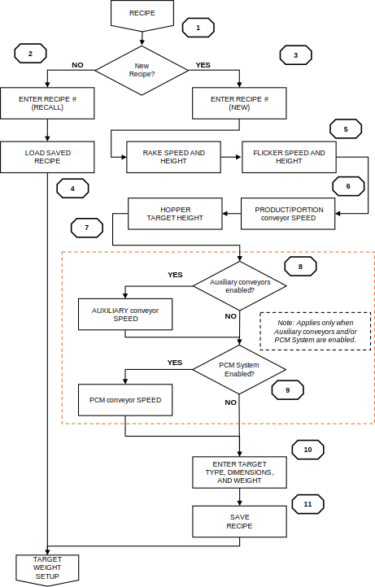

# 5  Recipe Setup

## 5.1 RECIPE Screen: Field Reference

<figure markdown>
  
  <figcaption>Figure 5.1  RECIPE screen</figcaption>
</figure>

All production parameters are stored in the RECIPE screen. Editable fields
have a yellow background with green text. See
[Appendix A: Recipe Starting Points](appendix-a.md) for starting point
values.

| **Field** | **Description** |
|---|---|
| **RAKE SPEED [20–100%]** | RAKE motor speed. Controls how aggressively topping is metered onto the PORTION CONVEYOR. |
| **RAKE HEIGHT [0.25–2.00 in]** | Vertical position of the RAKE above the PORTION CONVEYOR surface. Determines bed depth. |
| **HIGH LEVEL [30.0–50.0 lb]** | RAKE weight upper threshold. Set 5–10 lb above TARGET LEVEL. Above this value, RETURN #2 slows. This is the upper PID boundary, not a target. |
| **TARGET LEVEL [0.0–45.0 lb]** | RAKE weight PID setpoint. Start at the table value in Appendix A. Reduce if topping supply cannot sustain the level. |
| **LOW LEVEL [15.0–45.0 lb]** | RAKE weight lower threshold. Set 5–10 lb below TARGET LEVEL. Reached when the product bed no longer touches the side guards after the RAKE. Below this value, RETURN #2 accelerates. |
| **LO-LO LEVEL [5.0–20.0 lb]** | RAKE weight low-low threshold. Set to approximately 50–60% of TARGET LEVEL. Triggers PRIME mode prompt. Do not set too close to TARGET LEVEL. |
| **FLICKER SPEED [0–100%]** | Speed of the FLICKER motor. |
| **FLICKER HEIGHT [0.20–2.00 in]** | Vertical position of the FLICKER relative to the nose roller. |
| **HOPPER TARGET [0.0–6.0 in]** | Target topping height in the HOPPER area. Start at 4 inches. Increase if RETURN #2 flights appear under-filled. Decrease if topping overflows the HOPPER. |
| **PRODUCT [5–120 FPM]** | PRODUCT CONVEYOR speed. |
| **PORTION [0.50–24.1 FPM]** | PORTION CONVEYOR speed. Ensure the RAKE PID is balanced before enabling PORTION CONTROL. Use the starting point value as an initial position only. |
| **PCM FEED [0–62 FPM]** | PCM FEED CONVEYOR speed (if equipped). |
| **INFEED CONV [5–120 FPM]** | INFEED CONVEYOR speed (if equipped). |
| **OUTFEED CONV [5–120 FPM]** | OUTFEED CONVEYOR speed (if equipped). |
| **WEIGHT [0.01–16.0 oz]** | Target portion weight. |
| **DIAMETER / LENGTH [1.0–18.0 in]** | Target dimensions used for portion weight calculations. |

!!! note
    RAKE HEIGHT and PORTION CONVEYOR speed values cannot be changed while
    PORTION CONTROL is active.

---

## 5.2 Loading and Saving Recipes

1. Navigate to the RECIPE screen.
2. To load: enter the recipe number in RECIPE # [SAVE/LOAD]. Press and hold
   LOAD RECIPE for three seconds.
3. To create a new recipe: enter a recipe number and name. Enter all
   parameters. Press and hold SAVE RECIPE for three seconds.

!!! note
    The Applicator stores up to 128 recipes. Verify all parameters against
    the production specification before starting. See
    [Appendix A](appendix-a.md) for starting point values from production
    data. Saving to an existing recipe number overwrites it without
    confirmation. Verify the recipe number before saving.

---

## 5.3 RAKE Height Setup and Topping Compaction Assessment

RAKE height controls topping bed depth on the PORTION CONVEYOR. The bed
must be uniform with no voids across the full width. Any gap causes portion
weight variation.

### Topping Compaction Assessment Procedure

Before setting RAKE height, assess the topping's compaction:

1. Collect a representative sample sufficient to fill one hand.
2. Apply light pressure and open your hand. Poke the sample. If it separates
   freely, the topping is loose.
3. Squeeze moderately and open your hand. Poke the pile. Does it fall apart
   or hold its shape?
4. Squeeze firmly and open your hand. Does the pile retain its shape after
   poking?
5. Repeat steps 1 through 4 on two additional fresh samples to confirm the
   result is consistent across the lot.
6. Adjust RAKE height on the RECIPE screen in 0.10 in increments. Set the
   recipe and let prime complete fully. Allow approximately 100 targets to
   pass through before evaluating the bed. Recycled material must stabilize
   before the bed reflects the true recipe settings.
7. When the bed is uniform with no voids, save the recipe.

!!! note
    **High compaction** (topping holds shape after light or moderate
    pressure): indicates high moisture or stickiness. Reduce TARGET LEVEL
    first. A lighter pile reduces compaction pressure on the conveyor. Then
    set RAKE HEIGHT to the point where the bed rakes out cleanly with no
    voids.

    **Low compaction** (topping crumbles under firm pressure): start with
    the baseline TARGET LEVEL and RAKE HEIGHT from the recipe. Typical RAKE
    TARGET LEVEL ranges:

    - Shredded cheese (standard): 32–45 lb.
    - IQF / frozen product: 25–35 lb.
    - Mixed or vegetable toppings with varied piece sizes: similar to cheese
      range with RAKE SPEED reduced.

Long or sticky shred may need a slightly higher TARGET LEVEL to allow the
RAKE to push through and form a consistent bed. Adjust RAKE HEIGHT until
the bed is clean, then reduce TARGET LEVEL until compaction improves. Fine
or short shreds behave more freely and typically tolerate a lighter pile.

!!! note
    **Judging compaction by feeling develops with experience. A training video
    demonstrating this procedure is planned. A reference will be added here
    when available.**

!!! note
    Repeat the assessment when the topping lot changes, after extended idle
    periods, or when ambient conditions differ significantly from normal.
