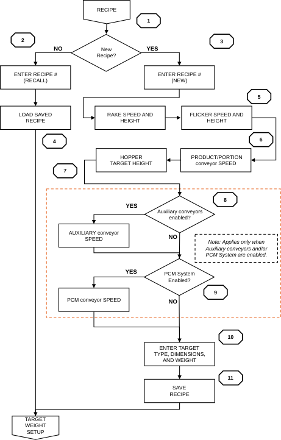

# 5  Recipe Setup

## 5.1 RECIPE Screen: Field Reference

<figure markdown>
  
  <figcaption>Figure 5.1  RECIPE screen</figcaption>
</figure>

All production parameters are stored in the RECIPE screen. Editable fields
have a yellow background with green text. See
[Section 11.3: RECIPE Screen](11-oi-reference.md#113-recipe-screen) for
screen layout and [Appendix A: Recipe Starting Points](appendix-a.md) for
starting point values for all fields.

| **Field** | **Description** |
|---|---|
| **RAKE SPEED [20–100%]** | RAKE motor speed. |
| **RAKE HEIGHT [0.25–2.00 in]** | Vertical position of the RAKE above the PORTION CONVEYOR surface. See [Section 5.3](#53-rake-height-setup-and-topping-compaction-assessment). |
| **HIGH LEVEL [30.0–50.0 lb]** | RAKE weight upper limit. RETURN #2 slows above this value. |
| **TARGET LEVEL [0.0–45.0 lb]** | RAKE weight setpoint. |
| **LOW LEVEL [15.0–45.0 lb]** | RAKE weight lower limit. RETURN #2 accelerates below this value. |
| **LO-LO LEVEL [5.0–20.0 lb]** | RAKE weight low-low threshold. Triggers PRIME mode prompt. |
| **FLICKER SPEED [0–100%]** | Speed of the FLICKER motor. |
| **FLICKER HEIGHT [0.20–2.00 in]** | Vertical position of the FLICKER above the PORTION CONVEYOR. |
| **HOPPER TARGET [0.0–6.0 in]** | Target topping height in the HOPPER area. See [Section 6.3](06-process-control.md#63-supply-and-demand-balance). |
| **PRODUCT [5–120 FPM]** | PRODUCT CONVEYOR speed. |
| **PORTION [0.50–24.1 FPM]** | PORTION CONVEYOR speed. See [Section 6.5](06-process-control.md#65-portion-conveyor-pid-control-portion-weight). |
| **PCM FEED [0–62 FPM]** | PCM FEED CONVEYOR speed (if equipped). |
| **INFEED CONV [5–120 FPM]** | INFEED CONVEYOR speed (if equipped). |
| **OUTFEED CONV [5–120 FPM]** | OUTFEED CONVEYOR speed (if equipped). |
| **WEIGHT [0.01–16.0 oz]** | PORTION WEIGHT setpoint. The amount of topping applied per target. |
| **DIAMETER / LENGTH [1.0–18.0 in]** | Target dimension used for portion weight calculations. Enter the diameter for round targets. Enter the longest dimension for rectangular targets. The active field is determined by the TARGET TYPE setting. |

!!! note
    RAKE HEIGHT and PORTION CONVEYOR speed values cannot be changed while
    PORTION CONTROL is active.

---

## 5.2 Loading and Saving Recipes

1. Navigate to the RECIPE screen.
2. To load: enter the recipe number in RECIPE # [SAVE/LOAD]. Press and hold
   LOAD RECIPE for three seconds.
3. To create a new recipe: enter a recipe number and name. Enter all
   parameters. Press and hold SAVE RECIPE for three seconds.

!!! note
    The Applicator stores up to 128 recipes. Verify all parameters against
    the production specification before starting. Saving to an existing
    recipe number overwrites it without confirmation. Verify the recipe
    number before saving.

---

## 5.3 RAKE Height Setup and Topping Compaction Assessment

RAKE HEIGHT and TARGET LEVEL work together and cannot be set independently.
RAKE HEIGHT acts as a gate: topping accumulates behind the RAKE up to the
point where the tines engage the pile. TARGET LEVEL is the weight the
RETURN #2 PID maintains to keep that pile consistently filled. Raising RAKE
HEIGHT allows a deeper pile to form; the PID supplies more material to reach
it. Lowering RAKE HEIGHT reduces bed depth; TARGET LEVEL follows. When one
is changed, the other must be re-evaluated.

The RAKE turns opposite to the PORTION CONVEYOR belt direction. The belt
carries material forward; the RAKE turns against it, creating a
rolling-back motion that forms a uniform, even bed. RAKE HEIGHT controls how
deeply the tines engage the pile. When the tines engage too deeply, they
strip material from the base rather than skimming the surface, leaving voids.
When height is set correctly, the tines skim the top of the pile and the
counter-rotation levels it cleanly.

### Topping Compaction Assessment Procedure

Before setting RAKE HEIGHT, assess the topping's compaction behavior:

1. Collect a representative sample sufficient to fill one hand.
2. Apply light pressure and open your hand. Poke the sample. If it separates
   freely, the topping is loose.
3. Squeeze moderately and open your hand. Poke the sample. Does it fall apart
   or hold its shape?
4. Squeeze firmly and open your hand. Try to break the sample apart by
   poking it. If the shreds pull apart cleanly, compaction is not yet at the
   damage threshold. If the sample holds together and will not separate
   without tearing the shreds, that is the damage threshold. The pile on the
   PORTION CONVEYOR must stay below this pressure level.
5. Adjust RAKE HEIGHT on the [RECIPE screen](#51-recipe-screen-field-reference)
   in 0.10 in increments. Set the recipe and let PRIME complete fully. Allow
   approximately 100 targets to pass through before evaluating the bed.
   Recycled material must stabilize before the bed reflects the true recipe
   settings.
6. When the bed is uniform with no voids, save the recipe. See
   [Section 5.2: Loading and Saving Recipes](#52-loading-and-saving-recipes).

  <iframe
    width="640" height="360"
    src="https://www.youtube.com/embed/Q00GPb4cNlM"
    frameborder="0"
    allowfullscreen
    title="Compaction Assessment"
    style="border-radius:4px; box-shadow:0 2px 8px rgba(0,0,0,0.25);">
  </iframe>
  

    Compaction Assessment
  

!!! note
    **High compaction** (topping holds shape under light or moderate
    pressure): indicates high moisture or stickiness. Raise RAKE HEIGHT first
    to reduce tine engagement depth. A shallower tine bite reduces compressive
    force on the pile. Reduce TARGET LEVEL only if raising RAKE HEIGHT alone
    does not resolve compaction.

    **Low compaction** (topping crumbles freely under firm pressure): start
    from the [Appendix A](appendix-a.md) baseline values. If the bed has
    voids, raise RAKE HEIGHT in 0.10 in increments.

    Both over-fill and under-fill produce the same symptom: voids and uneven
    coverage. If raising RAKE HEIGHT does not resolve voids, evaluate whether
    TARGET LEVEL is too high or too low before making further height
    adjustments.

    Typical TARGET LEVEL ranges:

    - Shredded cheese (standard): 32–45 lb.
    - IQF / frozen product: 25–35 lb.
    - Mixed or vegetable toppings with varied piece sizes: similar to cheese
      range, with RAKE SPEED reduced.

Long or sticky shreds tend to bridge across the RAKE tines. The tines are
staggered in two offset rows. A long shred can span the gap between tines
and drag laterally as the RAKE turns. That dragging pulls material away 
and leaves a void in the bed. Raise RAKE HEIGHT to reduce tine
engagement depth so shreds release rather than drag. Do not raise TARGET
LEVEL to compensate: a heavier pile increases compaction pressure, which
worsens the problem on sticky material. If voids persist after raising RAKE
HEIGHT, reduce RAKE SPEED. RAKE SPEED should not exceed 60%.

Fine or short shreds behave more freely. The pile can be lighter, and RAKE
HEIGHT can run lower.

!!! note
    Repeat the assessment when the topping lot changes, after extended idle
    periods, or when ambient conditions differ significantly from normal.