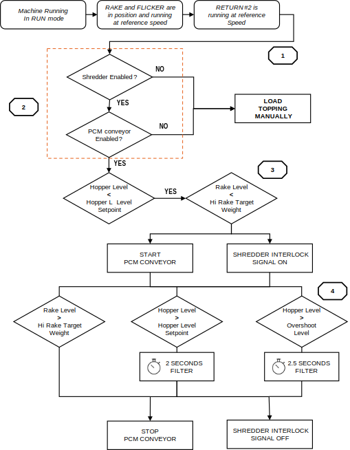
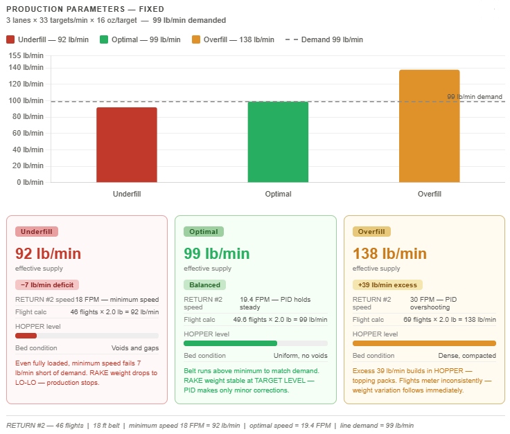
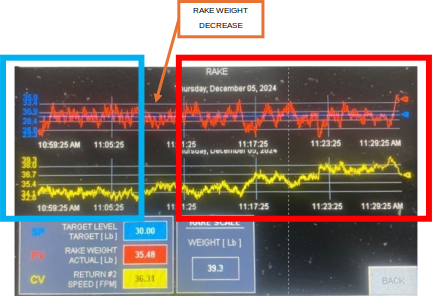

# 6  Process Control & Tuning

## 6.1 Three Critical System Checkpoints

When a weight or consistency problem occurs, work through these checkpoints
in order before adjusting any parameters. Most problems originate at
Checkpoint 1 or 2.

| **Checkpoint** | **Criteria for Correct Operation** |
|---|---|
| **1: HOPPER fill** | RETURN #2 flights must be uniformly filled at all times. Each flight holds approximately 1.8 to 2.2 lb of topping. Overfilled flights pack and meter irregularly. Underfilled flights cause the PID to over-accelerate before material reaches the RAKE load cells. |
| **2: RAKE weight** | RAKE LOAD CELL weight must stay stable at TARGET LEVEL. Weight instability at the RAKE is the most common cause of variation in portions. |
| **3: FLICKER dispersion** | The FLICKER must distribute topping evenly across the full target width. Uneven dispersion produces left-to-right weight variation that RAKE weight and PORTION CONVEYOR speed cannot correct. |

---

## 6.2 Automated Fill Control (PCM / SHREDDER Option)

<figure markdown>
  
  <figcaption>Figure 6.1  Automated fill control flowchart</figcaption>
</figure>

### Fill Start Criteria

Both conditions must be met simultaneously:

- HOPPER level is below the HOPPER TARGET value from the active recipe.
- RAKE LOAD CELL weight is below the HIGH-LEVEL threshold.

### Fill Stop Criteria

Any one of the following stops the fill cycle:

- RAKE LOAD CELL weight reaches or exceeds the HIGH-LEVEL limit.
- HOPPER level exceeds the overshoot-adjusted value (HOPPER TARGET +
  HOPPER OVERSHOOT HEIGHT) for 2.5 continuous seconds.
- HOPPER level reaches the Stop-Fill threshold for 2 continuous seconds.

!!! warning
    **Transport Delay.**
    The RETURN #2 conveyor has an inherent transport delay between the
    HOPPER and the RAKE load cells. The shredder or PCM feed rate must
    match the Applicator's topping consumption rate. HOPPER OVERSHOOT
    HEIGHT and HOPPER customer limits are set at MAINT → HOPPER.

---

## 6.3 Supply and Demand Balance

Every variable-speed drive on the Applicator meters material. RETURN #2 is
no different. At any given speed, each flight carries approximately 1.8 to
2.2 lb of topping and deposits it into the recirculation system once per
revolution. The rate at which material enters the system is set by belt
speed and cannot change faster than the PID responds.

The production line has a fixed demand: topping leaving the Applicator on
finished targets. RETURN #2 must supply that amount continuously. Too little
and the RAKE starves. Too much and the HOPPER overflows.

The example below uses a three-lane line running 33 targets per lane per
minute at 16 oz per target: a demand of 99 lb/min. The supply RETURN #2
delivers depends on two factors: how full each flight is, and how fast the
belt runs. Both must be correct simultaneously.

<figure markdown>
  
  <figcaption>Figure 6.3  RETURN #2 supply rate vs. line demand: Underfill, Optimal, and Overfill conditions</figcaption>
</figure>

### Underfill

Underfill occurs when RETURN #2 cannot deliver enough material to meet
demand. Two conditions cause it, and either one stops the system from
keeping up.

The first is partially loaded flights. If the HOPPER runs low due to a
shredder fault, a PCM gap, or a manual feed interruption, flights arrive
partially filled. At half capacity (1 lb per flight), RETURN #2 delivers
only 46 lb/min at minimum belt speed: 53 lb/min below demand. The PID
drives the belt faster to compensate, but partially empty flights mean
effective supply continues to fall regardless of belt speed. At 30 FPM with
half-loaded flights, supply reaches only 76.7 lb/min, still 22 lb/min
short.

The second is the minimum belt speed with fully loaded flights. Even with
every flight carrying a full 2 lb load, RETURN #2 at its minimum speed of
18 FPM delivers only 46 flights per minute: 92 lb/min. That is 7 lb/min
below the 99 lb/min demand. The minimum speed of RETURN #2 is not a ceiling
to avoid. It is a floor that must be exceeded whenever production demand
requires it.

In both cases, the RAKE weight drops progressively. When it falls below the
LO-LO LEVEL, the Applicator prompts PRIME mode and production stops.

### Optimal

RETURN #2 runs at the speed that matches fully loaded flights to demand. At
19.4 FPM, approximately 49.6 flights complete per minute at 2 lb each,
delivering 99 lb/min. The PID holds this speed, making small corrections as
RAKE weight drifts. The HOPPER stays at its target level, flights fill
consistently, and the topping bed is uniform across the full conveyor width.

### Overfill

Occurs when the PID commands RETURN #2 faster than the line can consume. At
30 FPM with fully loaded flights, the belt delivers 76.7 flights per minute
at 2 lb each: 153 lb/min into a system consuming 99. A 54 lb/min surplus
accumulates in the HOPPER. Topping packs under its own weight and flights
begin metering inconsistently. Weight variation follows immediately.

This is why HOPPER TARGET should be kept at or below 6 inches. Above that
level, the accumulated weight of topping in the HOPPER compresses the
material. What appears to be a full HOPPER is actually a packed mass that
does not meter correctly, regardless of what the PID commands.

!!! note
    When setting up a new recipe or a new topping type, confirm that
    RETURN #2 can run fast enough to meet the line's consumption rate with
    fully loaded flights. If the belt is running at or near maximum speed
    and RAKE weight is still falling, the topping supply source (shredder
    or PCM) is the constraint, not the PID. Contact Grote Service to
    evaluate the drive speed range for that application.

---

## 6.4 RETURN #2 PID Control (Rake Weight)

<figure markdown>
  
  <figcaption>Figure 6.4  RETURN #2 PID control block diagram</figcaption>
</figure>

| **Parameter** | **Value and Function** |
|---|---|
| **Process Variable (PV)** | Two-second rolling average of RAKE LOAD CELL weight. |
| **Setpoint (SP)** | TARGET LEVEL from the active recipe. |
| **Proportional Gain (P)** | 0.75: Immediate correction proportional to weight error. |
| **Integral Gain (I)** | 1.75 / min: Eliminates long-term steady-state deviation. |
| **Derivative Gain (D)** | 0.003 min: Dampens sudden weight fluctuations. |
| **Output** | RETURN #2 conveyor speed command, constrained by recipe HIGH LEVEL and LOW LEVEL limits. |

<figure markdown>
  
  <figcaption>Figure 6.4A  RAKE screen trend: TARGET LEVEL (blue), RAKE WEIGHT AVERAGE (red), RETURN #2 SPEED (yellow)</figcaption>
</figure>

- The green rectangle shows stable production: RAKE weight holds close to
  TARGET LEVEL, and RETURN #2 speed runs at a steady, low value. The PID
  is making only minor corrections.
- The arrow marks the first sign of trouble: RETURN #2 speed begins to
  climb. At this moment, the RAKE weight may still appear stable, but the
  PID has already detected a deficit and is commanding the belt to run
  faster to compensate. A rising RETURN #2 speed trend is an early warning
  that supply is falling behind demand. If the HOPPER is not replenished,
  RAKE weight will follow the speed upward and then drop sharply as the
  HOPPER empties.
- The red rectangle shows what follows: RAKE weight becomes erratic as the
  PID overcorrects against a starved HOPPER and RETURN #2 speed swings in
  response. This is the visual signature of a supply problem, not a PID
  tuning problem.

---

## 6.5 PORTION CONVEYOR PID Control (Portion Weight)

<figure markdown>
  { width="900" }
  <figcaption>Figure 6.5  Combined portion and rake control overview</figcaption>
</figure>

### Manual Setup and Weight Verification

1. The Applicator must be in RUN mode with priming complete.
2. Run targets through the Applicator. Weigh each after topping application.
3. Run approximately 100 targets and verify that weights are stable and
   consistent before proceeding.
4. Use the speed increment/decrement controls on the PORTION screen to
   adjust PORTION CONVEYOR speed until the applied weight matches the
   recipe target weight.
5. Press and hold TARE SCALE for three seconds. Perform the tare with the
   PORTION CONVEYOR running and carrying a representative topping load. The
   current weight and speed are saved as the baseline, and the load cell
   zeroes out, removing conveyor tare from the measurement.

### Enabling PID Portion Control

1. After the tare is complete and the target weight is verified, press
   TOGGLE PORTION CONTROL on the PORTION screen.
2. The PID loop activates and adjusts PORTION CONVEYOR speed automatically.

!!! note
    If the Applicator enters PRIME mode while PORTION CONTROL is active,
    PORTION CONTROL is disabled automatically. Re-enable it after priming
    is complete and the RAKE weight has stabilized at TARGET LEVEL. Do not
    enable PORTION CONTROL until target weights are stable and consistent.
    Starting the PID on an unstable baseline causes oscillation. When
    PORTION CONTROL is turned OFF, or the Applicator exits RUN mode,
    automatic adjustment stops, and PORTION CONVEYOR returns to the recipe
    baseline speed.

| **Parameter** | **Value and Function** |
|---|---|
| **Proportional Gain (P)** | 0.5: Immediate correction proportional to weight error. |
| **Integral Gain (I)** | 25 / min: Corrects persistent weight offset over time. |
| **Derivative Gain (D)** | 0.0: Not used for this process. |
| **Output** | PORTION CONVEYOR speed command, constrained by recipe min/max limits. |
