# 11  OI Reference

## 11.1 Navigation

The Applicator OI presents information across three regions: a fixed header
at the top, a fixed navigation bar at the bottom, and a main screen area
that changes based on the selected button. The header and navigation bar
remain visible on every screen.

<figure markdown>
  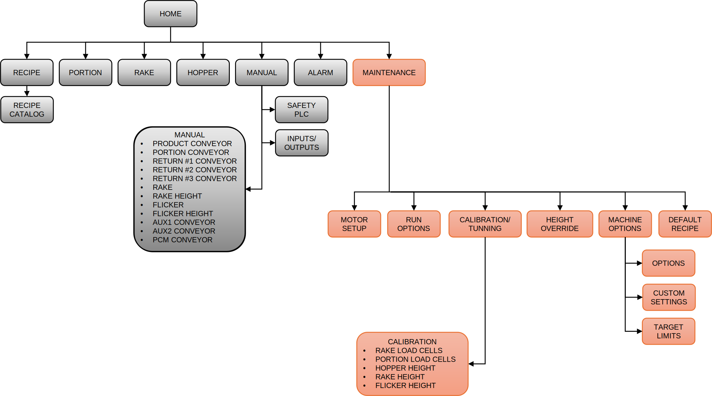{ width="700" }
  <figcaption>Figure 11.1  OI screen navigation overview</figcaption>
</figure>

!!! note
    Items shown in gray are accessible to all operators (DEFAULT login).
    Items shown in orange require a Maintenance login (GROTE). See
    [Section 11.9: MAINT Screens](#119-maint-screens).

### 11.1a Header

<figure markdown>
  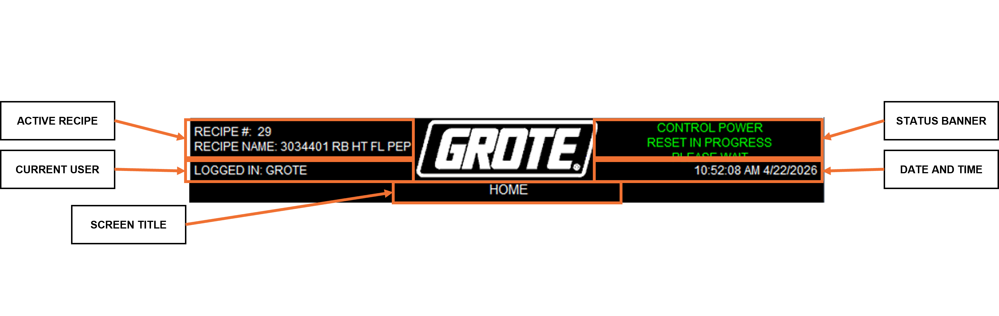{ width="700" }
  <figcaption>Figure 11.1a  Header Overview</figcaption>
</figure>

| **Display** | **Description** |
|---|---|
| **ACTIVE RECIPE** | Recipe number and name currently loaded. |
| **CURRENT USER** | Active login level: DEFAULT or GROTE. |
| **STATUS BANNER** | Banner reflecting the current Applicator state. See [Section 11.12: Applicator Status Banner](#1112-applicator-status-banner). |
| **DATE AND TIME** | Current system date and time. |
| **SCREEN TITLE** | Text identifying the currently active screen. |

### 11.1b Navigation Bar

<figure markdown>
  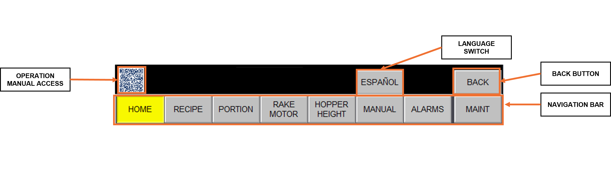{ width="700" }
  <figcaption>Figure 11.1b  Navigation Bar Overview</figcaption>
</figure>

| **Control** | **Description** |
|---|---|
| **OPERATION MANUAL ACCESS** | Scan QR code to open this Operation Manual. |
| **LANGUAGE SWITCH** | Toggles the OI language. |
| **BACK** | Returns to the previous screen. |
| **NAVIGATION BAR** | Buttons for navigating to HOME, RECIPE, PORTION, RAKE, HOPPER, MANUAL, ALARMS and MAINTENANCE screens. |

!!! note
    The active screen button turns yellow.

    The ALARM ACTIVE button flashes red when any alarm is present and
    returns to normal when all alarms are cleared.

---

## 11.2 HOME Screen

The HOME screen is the primary operating screen. It provides Applicator
start and stop controls, operating mode selection, and tension system
controls. See [Section 3: Startup](03-startup.md) and
[Section 4: Operating Modes](04-operating-modes.md).

<figure markdown>
  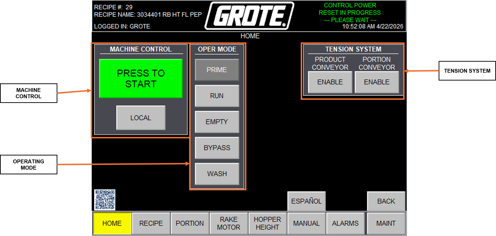{ width="500" }
  <figcaption>Figure 11.2  HOME screen</figcaption>
</figure>

| **Group** | **Description** |
|---|---|
| **MACHINE CONTROL** | MACHINE ENABLE is a physical pushbutton on the OI enclosure that arms the safety circuit. PRESS TO START and PRESS TO STOP are OI buttons that initiate and stop the selected operating mode. LOCAL / REMOTE selects the control source. See [Section 3: Startup](03-startup.md). |
| **OPERATING MODE** | Selects the operating mode. See [Section 4: Operating Modes](04-operating-modes.md). |
| **TENSION SYSTEM** | Enables or disables the tension cylinders. |

---

## 11.3 RECIPE Screen

The RECIPE screen provides recipe management. Editable fields are
highlighted in yellow or green. See
[Section 5: Recipe Setup](05-recipe-setup.md) and
[Appendix A: Recipe Starting Points](appendix-a.md).

<figure markdown>
  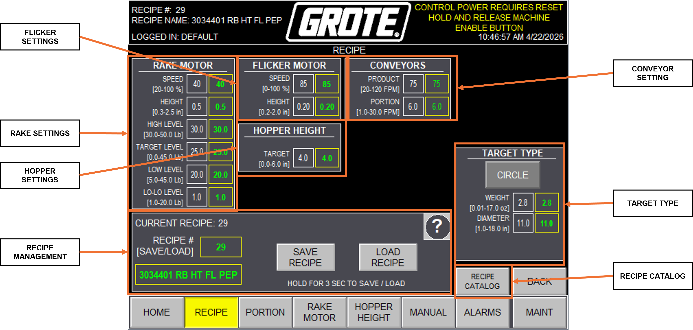{ width="500" }
  <figcaption>Figure 11.3  RECIPE screen</figcaption>
</figure>

| **Group** | **Description** |
|---|---|
| **RAKE SETTINGS** | RAKE setpoints. See [Section 5.1](05-recipe-setup.md#51-recipe-screen-field-reference). |
| **FLICKER SETTINGS** | FLICKER setpoints. |
| **HOPPER SETTINGS** | HOPPER setpoint. |
| **CONVEYOR SETTINGS** | Conveyor speed setpoints. |
| **TARGET TYPE** | Target shape and dimensions. |
| **RECIPE CATALOG** | Overview of stored recipes. |
| **RECIPE MANAGEMENT** | Recipe management. |

---

## 11.4 PORTION Screen

The PORTION screen monitors the portion weight PID loop. For control logic
and tuning, see
[Section 6.5: PORTION CONVEYOR PID Control](06-process-control.md#65-portion-conveyor-pid-control-portion-weight).

<figure markdown>
  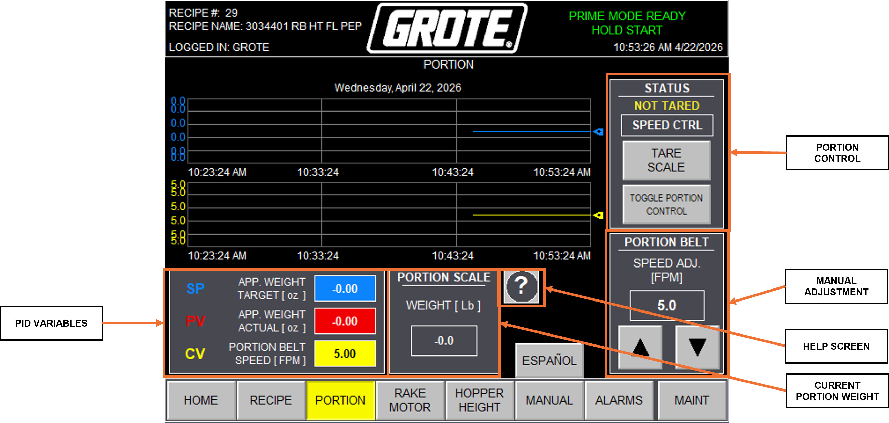{ width="500" }
  <figcaption>Figure 11.4  PORTION screen</figcaption>
</figure>

| **Group** | **Description** |
|---|---|
| **PID VARIABLES** | Setpoint: target applied weight per portion (oz). |
|  | Process variable: actual applied weight (oz). |
|  | Control variable: PORTION CONVEYOR speed output (FPM). |
| **PORTION CONTROL** | Portion control functions. |
| **MANUAL ADJUSTMENTS** | Speed/Weight manual adjustments. |
| **CURRENT PORTION WEIGHT** | Current portion weight display. |

---

## 11.5 RAKE Screen

The RAKE screen monitors the RETURN #2 PID loop. For control logic and
tuning, see
[Section 6.4: RETURN #2 PID Control](06-process-control.md#64-return-2-pid-control-rake-weight).

<figure markdown>
  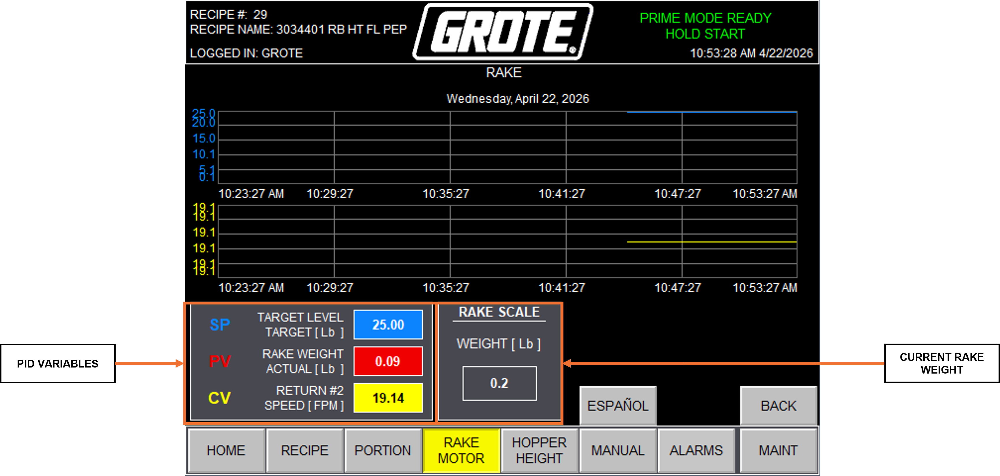{ width="500" }
  <figcaption>Figure 11.5  RAKE screen</figcaption>
</figure>

| **Control / Display** | **Description** |
|---|---|
| **PID VARIABLES** | Setpoint: target RAKE weight (lb). |
|   | Process variable: actual RAKE WEIGHT AVERAGE (lb). |
|   | Control variable: RETURN #2 speed command (FPM). |
| **CURRENT RAKE WEIGHT** | Current RAKE weight display. |

---

## 11.6 HOPPER Screen

The HOPPER screen displays HOPPER fill level relative to the TARGET LEVEL
set in the active recipe. For sensor calibration, see
[Section 9: HOPPER Height Calibration](09-hopper-height-calibration.md).

<figure markdown>
  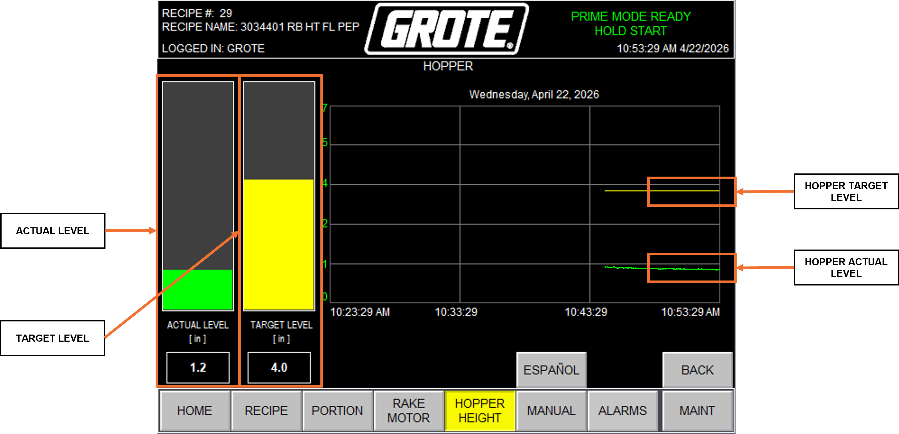{ width="500" }
  <figcaption>Figure 11.6  HOPPER screen</figcaption>
</figure>

| **Group** | **Description** |
|---|---|
| **ACTUAL LEVEL** | Current HOPPER fill height from the HOPPER HEIGHT SENSOR (in). |
| **TARGET LEVEL** | Target HOPPER fill height from the active recipe (in). |
| **HOPPER TARGET LEVEL** | Historical target level chart. |
| **HOPPER ACTUAL LEVEL** | Historical fill level chart. |

---

## 11.7 MANUAL Screens

The MANUAL screens provide access to individual drive service screens and
system diagnostic screens.

<figure markdown>
  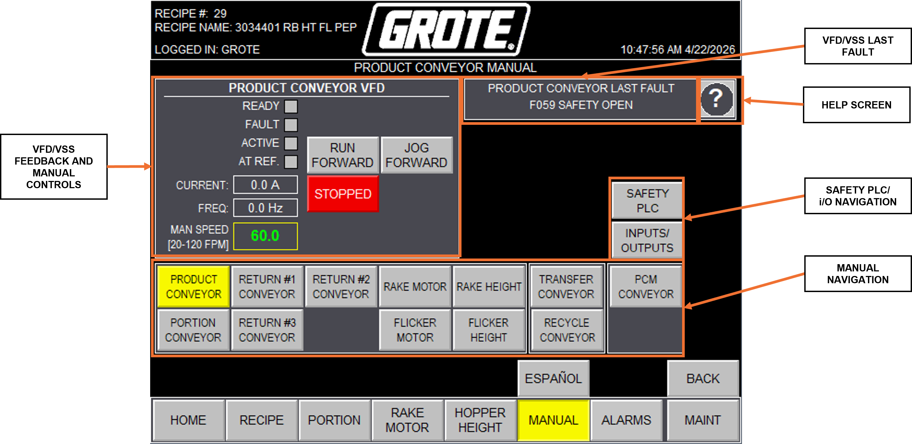{ width="500" }
  <figcaption>Figure 11.7  MANUAL screen</figcaption>
</figure>

| **Group** | **Description** |
|---|---|
| **VFD/VSS FEEDBACK AND CONTROL** | VFD/VSS drive feedback and manual control. |
| **VFD/VSS LAST FAULT** | Last recorded fault. |
| **HELP SCREEN** | Displays extended fault description and troubleshooting guidance. See [Section 12: Troubleshooting](12-troubleshooting.md). |
| **SAFETY PLC/IO NAVIGATION** | Navigation buttons to Safety PLC and I/O screens. |
| **MANUAL NAVIGATION** | Navigation to different drive manual screens. |

---

## 11.8 ALARMS Screen

The ALARMS screen logs active and historical alarm events. For fault
descriptions and corrective actions, see
[Section 12: Troubleshooting](12-troubleshooting.md).

<figure markdown>
  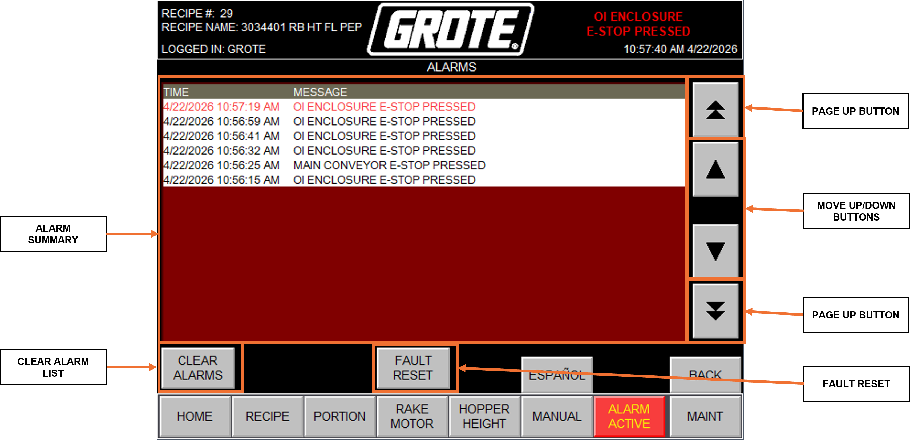{ width="500" }
  <figcaption>Figure 11.8  ALARMS screen</figcaption>
</figure>

| **Group** | **Description** |
|---|---|
| **ALARM SUMMARY** | Timestamped list of alarm events. |
| **CLEAR ALARM LIST** | Clears the alarms in the alarm banner. |
| **FAULT RESET** | Resets latched system faults. |
| **UP/DOWN BUTTONS** | Alarm banner up/down navigation. |

!!! note
    | **State** | **Appearance** |
    |---|---|
    | Active | Red background, white text. |
    | Inactive | White background, black text. |
    | Selected | White background, red text. |

---

## 11.9 MAINT Screens

The MAINT screen provides access to drive configuration, calibration, and
system settings. A GROTE login is required.

<figure markdown>
  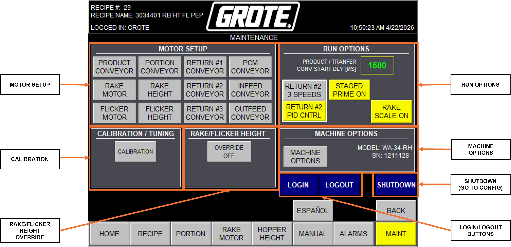{ width="500" }
  <figcaption>Figure 11.9  MAINT screen</figcaption>
</figure>

| **Group** | **Function** |
|---|---|
| **MOTOR SETUP** | Drive scaling and limit configuration. |
| **CALIBRATION** | Load cell and height sensor calibration. |
| **HEIGHT OVERRIDE** | RAKE/FLICKER encoder override. |
| **RUN OPTIONS** | Aux1/Aux2 start delay. |
| **MACHINE OPTIONS** | Navigation to the machine options display. |
| **SHUTDOWN** | Navigates to the shutdown configuration screen. |
| **LOGIN/LOGOUT** | User login and logout controls. |

---

## 11.10 Motor Setup Screens

Each drive has a dedicated Motor Setup screen. See
[Section 7: Motor Speed Scaling](07-motor-speed-scaling.md).

<figure markdown>
  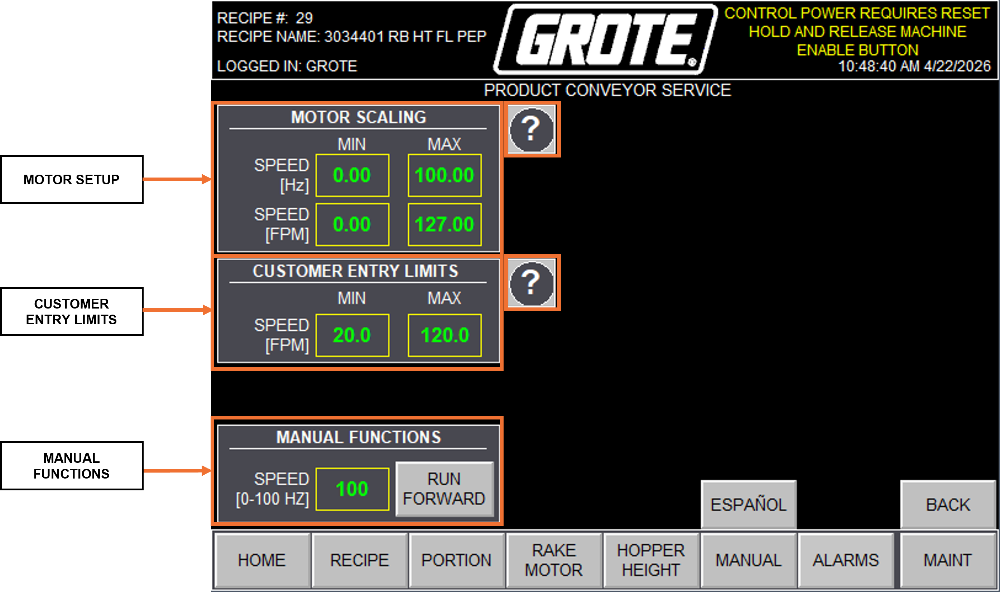{ width="500" }
  <figcaption>Figure 11.10  Motor Setup screen: PRODUCT CONVEYOR / PCM / RAKE / FLICKER</figcaption>
</figure>

All Motor Setup screens share the following fields:

| **Group** | **Description** |
|---|---|
| **MOTOR SCALING** | Sets MIN and MAX operating speed. |
| **CUSTOMER ENTRY LIMITS** | Sets the MIN and MAX speed values operators can enter on recipe and manual control screens. |
| **MANUAL FUNCTIONS** | Manual drive control. Enter speed in Hz and press RUN FORWARD. |

!!! note
    These fields apply to PRODUCT CONVEYOR, PCM CONVEYOR, RAKE, and FLICKER
    drives. PORTION CONVEYOR, HEIGHT motors, RETURN, and AUX drives include
    additional fields documented below.

### PRODUCT CONVEYOR / PCM CONVEYOR / RAKE / FLICKER

These drives use the common field set above. No additional fields apply.

### PORTION CONVEYOR

<figure markdown>
  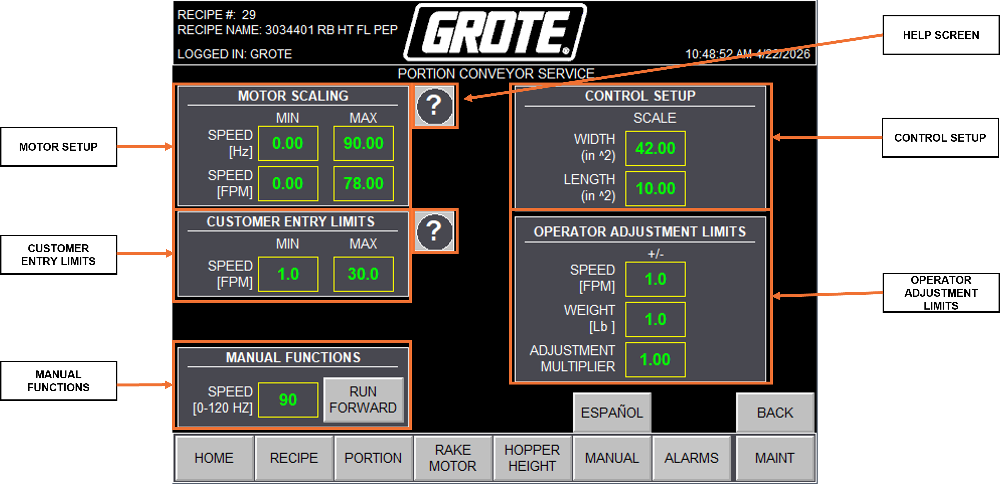{ width="500" }
  <figcaption>Figure 11.11  Motor Setup screen: PORTION CONVEYOR</figcaption>
</figure>

| **Group** | **Description** |
|---|---|
| **CONTROL SETUP** | Defines the active belt area for applied weight calculations. See [Section 6.5](06-process-control.md#65-portion-conveyor-pid-control-portion-weight). |
| **OPERATOR ADJUSTMENT LIMITS** | Sets the allowable speed adjustment range on the PORTION screen. See [Section 5](05-recipe-setup.md). |

### RAKE HEIGHT MOTOR / FLICKER HEIGHT MOTOR

For step-by-step calibration procedures, see
[Section 8: Load Cell Calibration](08-load-cell-calibration.md),
[Section 9: HOPPER Height Calibration](09-hopper-height-calibration.md),
and
[Section 10: RAKE/FLICKER Height Calibration](10-rake-flicker-calibration.md).

<figure markdown>
  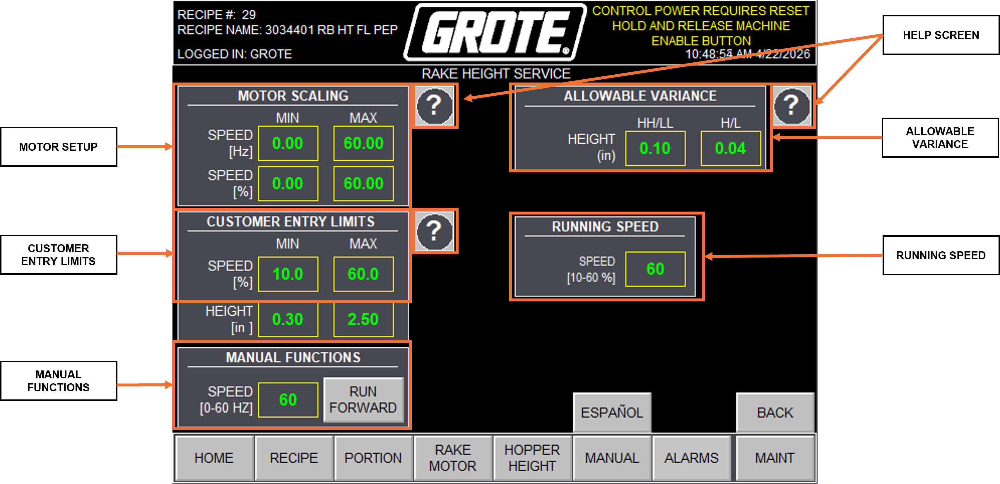{ width="500" }
  <figcaption>Figure 11.12  Motor Setup screen: RAKE HEIGHT MOTOR / FLICKER HEIGHT MOTOR</figcaption>
</figure>

| **Group** | **Description** |
|---|---|
| **ALLOWABLE VARIANCES** | Position tolerance band for height moves. |
| **RUNNING SPEED** | Height motor speed. (Recommended: 60%) |

!!! note
    Current Applicators use encoders for RAKE HEIGHT and FLICKER HEIGHT
    position feedback. Earlier Applicators used potentiometers and proximity
    limit switches.

### RETURN #1 / RETURN #3

<figure markdown>
  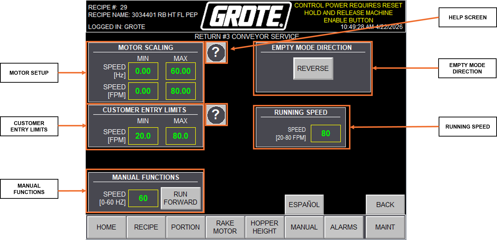{ width="500" }
  <figcaption>Figure 11.13  Motor Setup screen: RETURN #1 / RETURN #3</figcaption>
</figure>

| **Group** | **Description** |
|---|---|
| **EMPTY MODE DIRECTION** | Selects conveyor direction during EMPTY mode. See [Section 4.4: EMPTY Mode](04-operating-modes.md#44-empty-mode). |
| **RUNNING SPEED** | Target belt speed. (Recommended: 80 FPM). |

### RETURN #2

<figure markdown>
  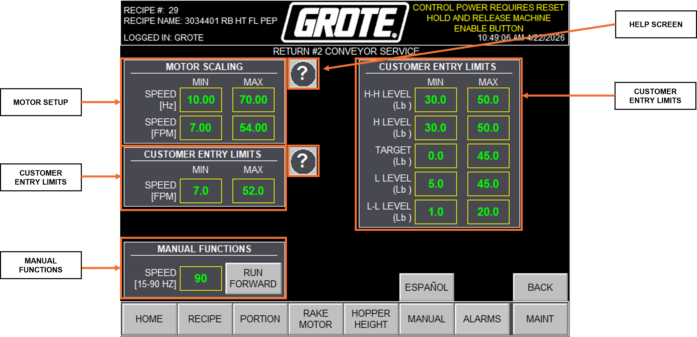{ width="500" }
  <figcaption>Figure 11.14  Motor Setup screen: RETURN #2</figcaption>
</figure>

| **Group** | **Description** |
|---|---|
| **CUSTOMER ENTRY LIMITS (LOAD CELL)** | Sets the MIN and MAX weight limits for the RAKE LOAD CELL operating range. See [Section 5.1](05-recipe-setup.md#51-recipe-screen-field-reference). |

### AUX 1 / AUX 2

<figure markdown>
  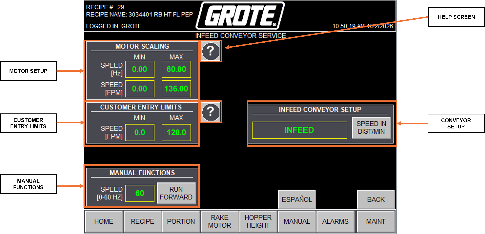{ width="500" }
  <figcaption>Figure 11.15  Motor Setup screen: AUX 1 / AUX 2</figcaption>
</figure>

| **Field** | **Description** |
|---|---|
| **CONVEYOR SETUP** | Sets the name and speed unit (FPM or %) for each AUX conveyor. |

---

## 11.11 Calibration Screens

All calibration screens share a common button bar for switching between
calibration types. See
[Section 8: Load Cell Calibration](08-load-cell-calibration.md),
[Section 9: HOPPER Height Calibration](09-hopper-height-calibration.md),
and
[Section 10: RAKE/FLICKER Height Calibration](10-rake-flicker-calibration.md)
for step-by-step procedures.

<figure markdown>
  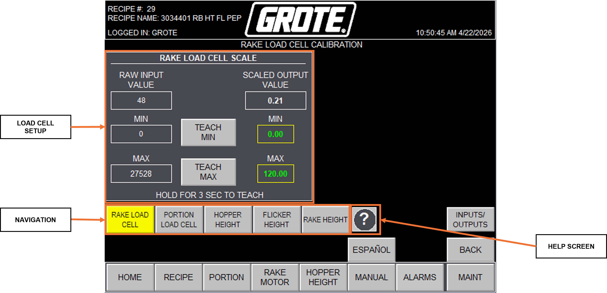{ width="500" }
  <figcaption>Figure 11.16  Calibration screen: RAKE LOAD CELL / PORTION LOAD CELL</figcaption>
</figure>

### RAKE LOAD CELL / PORTION LOAD CELL

| **Group** | **Description** |
|---|---|
| **LOAD CELL SETUP** | Captures MIN and MAX calibration points. See [Section 8](08-load-cell-calibration.md). |

### HOPPER HEIGHT

<figure markdown>
  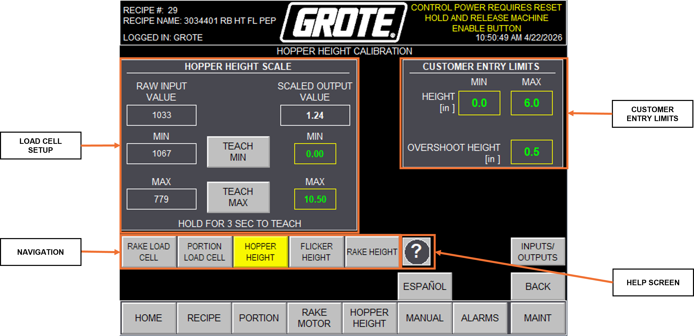{ width="500" }
  <figcaption>Figure 11.17  Calibration screen: HOPPER HEIGHT</figcaption>
</figure>

| **Group** | **Description** |
|---|---|
| **HOPPER HEIGHT SETUP** | Captures MIN and MAX calibration points for the HOPPER HEIGHT SENSOR. See [Section 9](09-hopper-height-calibration.md). |
| **CUSTOMER LIMITS** | Sets the allowable HOPPER TARGET entry range. See [Section 6.2](06-process-control.md#62-automated-fill-control-pcm--shredder-option). |

### RAKE HEIGHT / FLICKER HEIGHT

<figure markdown>
  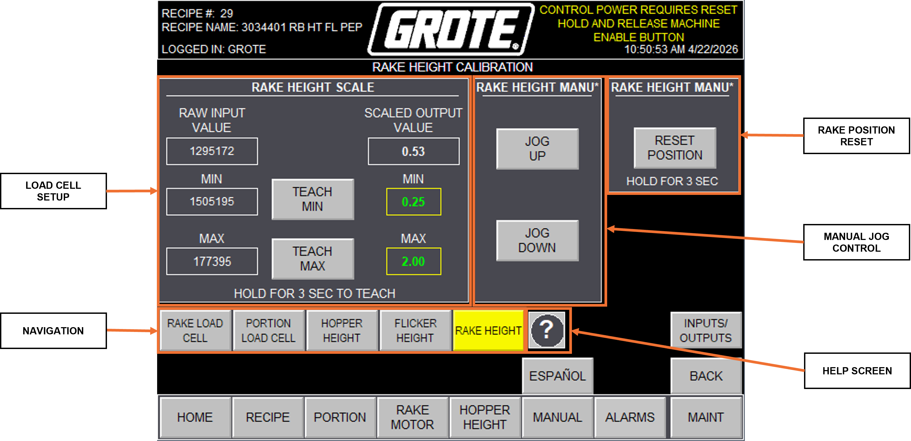{ width="500" }
  <figcaption>Figure 11.18  Calibration screen: RAKE HEIGHT / FLICKER HEIGHT</figcaption>
</figure>

| **Group** | **Description** |
|---|---|
| **RAKE HEIGHT SETUP / FLICKER HEIGHT SETUP** | Establishes the height travel range using encoder position references. See [Section 10](10-rake-flicker-calibration.md). |
| **HEIGHT MANUAL CONTROL** | Jogs the height motor UP or DOWN for positioning during calibration. |
| **HEIGHT POSITION RESET** | Resets the encoder reference position to zero. |

---

## 11.12 Applicator Status Banner

The Applicator Status Banner appears at the top of every screen and updates
continuously to reflect the current Applicator state. For mode-by-mode
behavior, see [Section 4: Operating Modes](04-operating-modes.md).

| **Banner Message** | **Color** | **Condition** |
|---|---|---|
| MACHINE FAULTED GO TO ALARMS SCREEN | RED | Active fault. Navigate to the [ALARMS screen](11-oi-reference.md#118-alarms-screen) and press FAULT RESET after correcting all conditions. |
| MAJOR FAULT EXISTS MACHINE STOPPED CHECK ALARMS | RED | Critical fault. Applicator stopped. Navigate to the [ALARMS screen](11-oi-reference.md#118-alarms-screen). |
| LOCAL MODE ONLY FUNCTION PUT MACHINE IN LOCAL MODE | RED | A LOCAL-only function was attempted in REMOTE mode. Switch to LOCAL at the HOME screen. |
| OI ENCLOSURE E-STOP PRESSED | RED | Emergency stop active at OI enclosure. Pull the actuator to release, then press MACHINE ENABLE. |
| PRODUCT CONVEYOR E-STOP PRESSED | RED | Emergency stop active at PRODUCT CONVEYOR. Pull the actuator to release, then press MACHINE ENABLE. |
| INFEED CONVEYOR E-STOP PRESSED (WHEN EQUIPPED) | RED | Emergency stop active at INFEED CONVEYOR. Pull the actuator to release, then press MACHINE ENABLE. |
| OUTFEED CONVEYOR E-STOP PRESSED | RED | Emergency stop active at OUTFEED CONVEYOR. Pull the actuator to release, then press MACHINE ENABLE. |
| REMOTE OI ENCLOSURE E-STOP PRESSED (WHEN EQUIPPED) | RED | Emergency stop active at REMOTE OI ENCLOSURE. Pull the actuator to release, then press MACHINE ENABLE. |
| MAIN GUARD OPEN | RED | MAIN GUARD is open. Close the guard fully, then press MACHINE ENABLE. |
| RETURN #2 GUARD OPEN | RED | RETURN #2 guard is open. Close the guard fully, then press MACHINE ENABLE. |
| CONTROL POWER REQUIRES RESET HOLD AND RELEASE MACHINE ENABLE BUTTON | YELLOW | Control power requires reset. Hold and release the MACHINE ENABLE button. |
| CONTROL POWER RESET IN PROGRESS - PLEASE WAIT - | YELLOW | Control power reset sequence in progress. Wait for completion. |
| MOVING RAKE AND FLICKER INTO POSITION - PLEASE WAIT - | YELLOW | RAKE and FLICKER are moving to recipe positions. Wait for travel to complete. |
| ENABLE PRODUCT BELT TENSION | YELLOW | PRODUCT CONVEYOR tension cylinder is not extended. Enable from the HOME screen. *(PLC string pending revision.)* |
| ENABLE PORTION CONVEYOR TENSION | YELLOW | PORTION CONVEYOR tension cylinder is not extended. Enable from the HOME screen. |
| MACHINE REQUIRES PRIME BEFORE RUN MODE ALLOWED | YELLOW | Priming criteria not met. Select PRIME mode and complete the priming sequence before selecting RUN. See [Section 4.3: PRIME Mode](04-operating-modes.md#43-prime-mode). |
| MACHINE STARTED IN REMOTE MODE WAITING FOR DOWNSTREAM INTERLOCK | YELLOW | Applicator started in REMOTE mode. Waiting for downstream interlock signal. |
| REMOTE RUN MODE STOPPED FROM OI HOLD START TO RESTART | YELLOW | Applicator stopped from the OI while in REMOTE mode. Hold PRESS TO START to restart. |
| REMOTE RUN MODE STOPPED FROM LINE CONTROLLER OI HOLD START TO RESTART | YELLOW | Applicator stopped by the line controller while in REMOTE mode. Hold PRESS TO START to restart. |
| ---- PRIME COMPLETED ---- REMOTE RUN MODE READY HOLD START | YELLOW | Priming complete. Applicator in REMOTE mode and ready to start. Hold PRESS TO START. |
| MACHINE RUNNING CONSERVE MODE ACTIVE | YELLOW | No target detected within the CONSERVE timer period. All motors except PRODUCT CONVEYOR, INFEED CONVEYOR, and OUTFEED CONVEYOR have stopped. Clears automatically when a target is detected. |
| MACHINE RUNNING | GREEN | Applicator running in RUN mode. Topping application active. |
| MACHINE RUNNING IN PRIME MODE | GREEN | PRIME mode sequence executing. |
| MACHINE RUNNING IN EMPTY MODE | GREEN | Applicator in EMPTY mode. |
| MACHINE RUNNING IN LOCAL BYPASS MODE | GREEN | PRODUCT CONVEYOR running without topping application. LOCAL control. |
| MACHINE RUNNING IN REMOTE BYPASS MODE | GREEN | PRODUCT CONVEYOR running without topping application. REMOTE control. |
| MACHINE RUNNING IN WASH MODE | GREEN | Applicator in WASH mode at preset speeds and heights. |
| ---- PRIME COMPLETED ---- LOCAL RUN MODE READY HOLD START | GREEN | Priming complete. Applicator in LOCAL mode and ready to start. |
| PRIME MODE READY HOLD START | GREEN | PRIME mode selected and ready. Hold PRESS TO START for three seconds. |
| EMPTY MODE READY HOLD START | GREEN | EMPTY mode selected and ready. Hold PRESS TO START for three seconds. |
| BYPASS MODE READY HOLD START | GREEN | BYPASS mode selected and ready. Start the Applicator. |
| WASH MODE READY HOLD START | GREEN | WASH mode selected and ready. Hold PRESS TO START for three seconds. |

---

## 11.13 STACKLIGHT Reference

The STACKLIGHT provides at-a-glance Applicator status visible from across
the production floor. See [Section 2: Equipment Overview](02-equipment-overview.md)
or [Appendix B: Glossary](appendix-b.md#stacklight).

| **Indicator** | **State** | **Meaning** |
|---|---|---|
| HORN | Pulsing | Applicator starting |
| RED | Blinking | Not enabled |
| RED | Solid | Faulted |
| YELLOW | Blinking | Low topping level |
| YELLOW | Solid | Topping level empty |
| GREEN | Blinking | Ready to run |
| GREEN | Solid | Running |

---

## 11.14 MACHINE OPTIONS Reference

MACHINE OPTIONS enables or disables optional equipment and configuration
settings. Changes here affect which controls and PID loops are active
throughout the OI.

### Toggle Options

| **Option** | **Function** | **Default** |
|---|---|---|
| **IMPERIAL / METRIC** | Sets the unit system for all weight and dimension readouts throughout the OI. | IMPERIAL |
| **RAKE HEIGHT ADJ / NO RAKE HEIGHT ADJ** | Enables or disables the RAKE HEIGHT MOTOR and associated controls. | RAKE HEIGHT ADJ |
| **FLICKER HEIGHT ADJ / NO FLICKER HEIGHT ADJ** | Enables or disables the FLICKER HEIGHT MOTOR and associated controls. | FLICKER HEIGHT ADJ |
| **HOPPER SENSOR / NO HOPPER SENSOR** | Enables or disables the HOPPER HEIGHT SENSOR input. | HOPPER SENSOR |
| **PORTION SCALES / NO PORTION SCALES** | Enables or disables the PORTION LOAD CELL inputs and PORTION PID loop. | PORTION SCALES |
| **RAKE SCALES / NO RAKE SCALES** | Enables or disables the RAKE LOAD CELL inputs and RETURN #2 PID loop. | RAKE SCALES |
| **SHREDDER CONTROL / NO SHREDDER** | Enables or disables the SHREDDER interlock output and automated fill sequence. | NO SHREDDER |
| **PCM CONV / NO PCM CONV** | Enables or disables the PCM conveyor option. | NO PCM CONV |
| **AUX 1 CONV / NO AUX 1 CONV** | Enables or disables the AUX 1 auxiliary conveyor. | NO AUX 1 CONV |
| **AUX 2 CONV / NO AUX 2 CONV** | Enables or disables the AUX 2 auxiliary conveyor. | NO AUX 2 CONV |
| **SPEED FOLLOW / NO SPEED FOLLOW** | Enables or disables the external speed follow (line synchronization) input. | NO SPEED FOLLOW |

### Custom Settings

<figure markdown>
  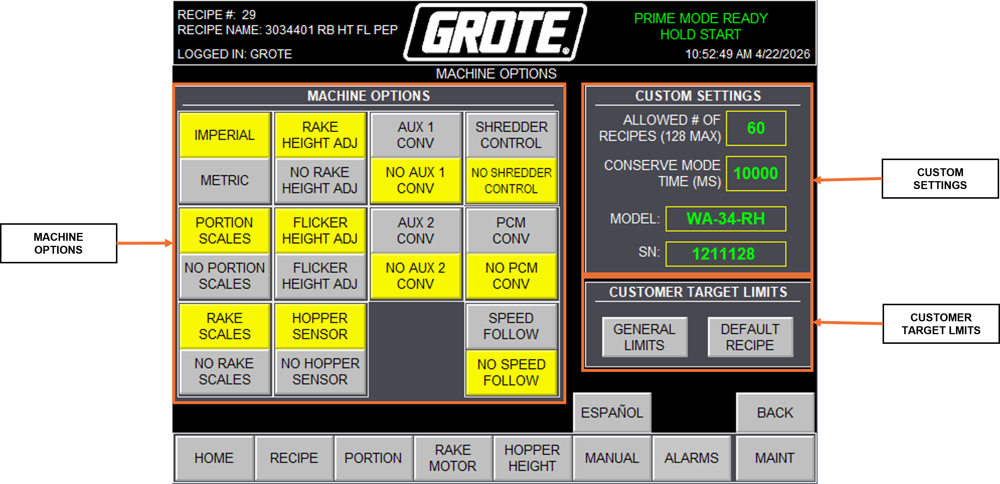{ width="500" }
  <figcaption>Figure 11.19  MACHINE OPTIONS custom settings</figcaption>
</figure>

| **Setting** | **Description** |
|---|---|
| **ALLOWED # OF RECIPES** | Maximum number of stored recipes. |
| **CONSERVE MODE TIME (MS)** | CONSERVE timer duration (ms). See [Section 4.7: CONSERVE Mode](04-operating-modes.md#47-conserve-mode). |
| **APPLICATOR MODEL** | Applicator model number. |
| **SERIAL NUMBER** | Applicator serial number. |

### General Limits

<figure markdown>
  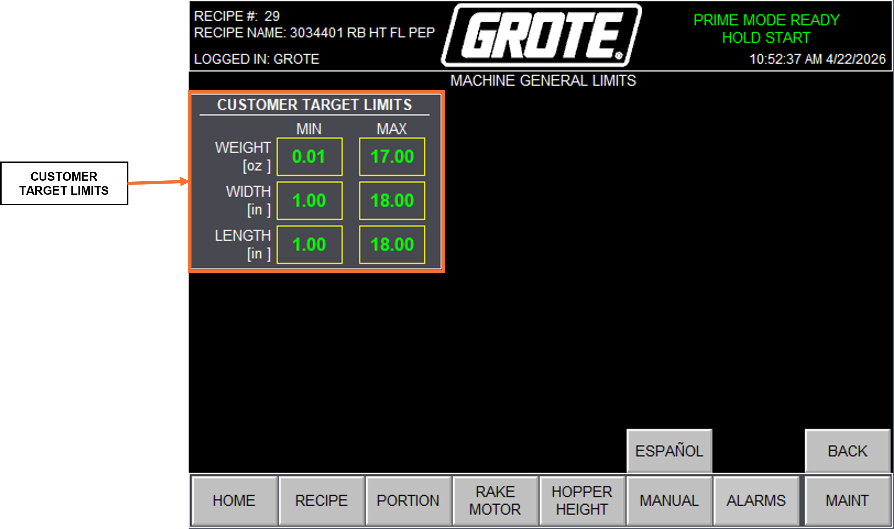{ width="500" }
  <figcaption>Figure 11.20  MACHINE OPTIONS general limits</figcaption>
</figure>

| **Field** | **Description** |
|---|---|
| **TARGET DIMENSIONS** | Minimum and maximum target length and width (in). |
| **PRODUCT LIMITS** | Minimum and maximum applied topping weight per target. |

### Default Recipe

<figure markdown>
  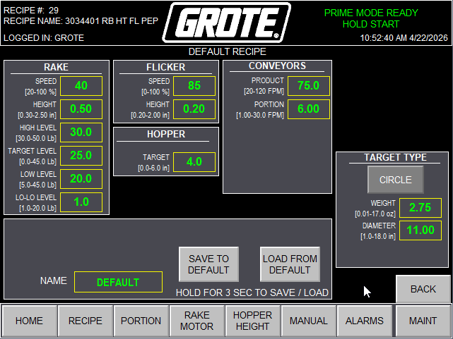{ width="500" }
  <figcaption>Figure 11.21  Default recipe screen</figcaption>
</figure>

| **Field** | **Description** |
|---|---|
| **DEFAULT RECIPE** | Saves the currently loaded recipe as the system default. |

---

<!-- ============================================================
OPEN ITEMS: Section 11
==============================================================
OI-11-01: Identify the two banner messages in Section 11.12 that
          currently display "HMI" on the physical OI screen instead
          of "OI." Mark those rows once confirmed by Jeff.
          Pending PLC revision.
============================================================ -->